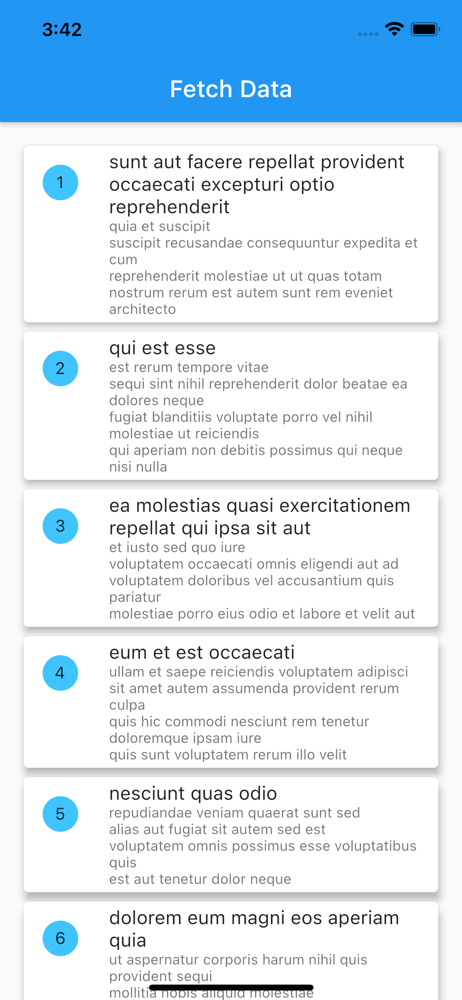

    
# Flutter Tutorial - Flutter Fetch Data From API using Riverpod as State Management.
[][youtube]
[][twitter]

   

How to display toast messages in Flutter and learn what the difference is to Flutter SnackBars.

### ✌&ensp;Preview

|              App Preview           |
| :----------------------------------|
|  | <a href="https://youtu.be/Y4FnwaXYDw0" target="_blank">

### 📺&ensp;Watch Video

##### [YouTube video](https://www.youtube.com/watch?v=Y4FnwaXYDw0 "Youtube PesaCoder") where the *source code* is explained. [Subscribe YouTube channel.](https://www.youtube.com/PesaCoder?sub_confirmation=1 "YouTube Subscribe PesaCoder")  

➜&ensp;[Watch My Video](https://www.youtube.com/watch?v=Y4FnwaXYDw0 "Watch My Video")

### ⚡&ensp;Social Media

&ensp;YouTube: [@PesaCoder](https://www.youtube.com/PesaCoder?sub_confirmation=1 "YouTube Johannes Milke")

&ensp;Twitter: [@PesaCoder](https://twitter.com/intent/follow?original_referer=https%3A%2F%2Fgithub.com%2FPesaCoder&screen_name=PesaCoder "Twitter PesaCoder")

&ensp;Facebook: [@PesaCoder](https://www.facebook.com/PesaCoder "Facebook Pesa Coder")
    
&ensp;Facebook: [@PesaCoder](https://www.facebook.com/PesaCoder "Facebook Pesa Coder")

&ensp;LinkedIn: [@PesaCoder](https://linkedin.com/in/PesaCoder "LinkedIn Pesa Coder")

&ensp;Instagram: [@PesaCoder](https://instagram.com/PesaCoder "Instagram Pesa Coder")

&ensp;GitHub: [@PesaCoder](https://github.com/PesaCoder "GitHub Pesa Coder")

&ensp;Medium: [@PesaCoder](https://medium.com/@PesaCoder "Medium Pesa Coder")

[twitter]: https://twitter.com/intent/follow?original_referer=https%3A%2F%2Fgithub.com%2FPesaCoder&screen_name=PesaCoder
[youtube]: https://www.youtube.com/PesaCoder?sub_confirmation=1
[courses]: https://PesaCoder.teachable.com/p/home
[newsletter]: https://PesaCoder.com/#/newsletter
[sponsor]: https://github.com/sponsors/PesaCoder
